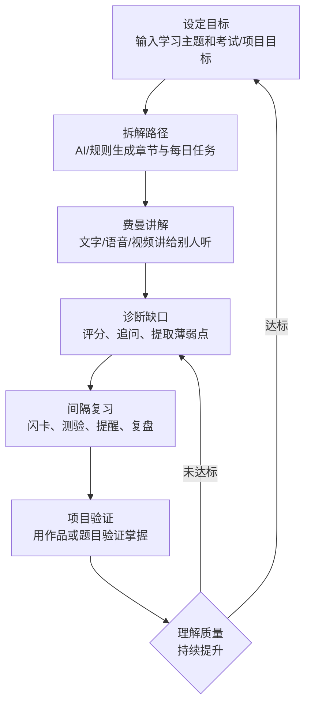
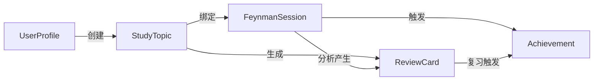

# 费曼学习法仿App 旗舰版 - 产品需求文档 (PRD)

## 1. 产品概述

**费曼学习法仿App 旗舰版** 是一款基于费曼学习法（Feynman Technique）的移动端学习管理应用。核心理念为「把知识讲明白，才是真的学会」，通过「设定目标 → 拆解路径 → 费曼讲解 → 诊断缺口 → 间隔复习 → 项目验证」六大闭环流程，帮助用户实现高效深度学习。

- **目标用户**: 自主学习者、备考学生、技术从业者、知识创作者
- **核心价值**: 本地优先、离线可用、零后端依赖、AI辅助学习路径规划

## 2. 核心功能

### 2.1 功能模块总览

| 序号 | 模块名称 | 核心功能 | 对应UI |
|------|---------|---------|--------|
| 1 | 启动页/引导页 | 品牌展示、今日目标预览、进入应用 | Screen 01 |
| 2 | 首页智能仪表盘 | AI学习建议、快捷入口卡片、本周成长曲线 | Screen 02 |
| 3 | 学习路径 | 路径列表与进度、搜索筛选、AI生成路径 | Screen 03-04 |
| 4 | 费曼讲解 | 文字/语音讲解编辑器、AI追问、实时指标 | Screen 05-06 |
| 5 | AI诊断 | 知识缺口雷达图、薄弱点列表、补救任务生成 | Screen 07 |
| 6 | 知识图谱 | 可视化关联网络、节点详情面板 | Screen 08 |
| 7 | 闪卡复习 | 间隔重复算法、翻面自评、到期提醒 | Screen 09 |
| 8 | 智能测验 | 自动出题、多选题、即时解析 | Screen 10 |
| 9 | 今日计划 | 周历视图、时间块排程、AI自动调度规则 | Screen 11 |
| 10 | 项目实践 | 实战任务清单、子任务勾选、作品提交归档 | Screen 12 |
| 11 | 导入导出 | TXT/Word/JSON/ZIP多格式、版本回滚 | Screen 13 |
| 12 | 设置中心 | 主题切换、提醒规则、数据管理、PWA安装 | Screen 14 |
| 13 | 讲解广场 | 同伴讲解流、清晰度评分、点赞互动(可关闭) | Screen 15 |
| 14 | 学习分析 | 多维度指标、热力日历、月度建议 | Screen 16 |
| 15 | 深色模式 | 夜间主题、专注计时器 | Screen 17 |
| 16 | 成就系统 | 等级进度、徽章收集、连续打卡 | Screen 18 |

### 2.2 页面功能详述

#### 2.2.1 启动页 (Screen 01)
| 模块 | 功能描述 |
|------|---------|
| 品牌区 | 展示「费曼学习」品牌名和Slogan，带脑图标按钮，浅蓝紫渐变背景+圆形装饰 |
| 今日目标卡片 | 显示当日目标（如：完成1次费曼讲解 + 10张闪卡复习），含进度条 |
| 引导文案 | 「开始构建你的知识宇宙」 |
| 主操作按钮 | 圆角蓝色大按钮「立即开始」，点击进入首页 |

#### 2.2.2 首页仪表盘 (Screen 02)
| 模块 | 功能描述 |
|------|---------|
| 顶部问候 | 显示时间+用户名（如"晚上好，Alex"）+ 副标题 + 连续天数徽章 |
| AI建议卡片 | 蓝色渐变卡片，显示个性化学习建议，可展开/收起 |
| 快捷入口网格 | 2×3卡片网格：知识路径(进度)、闪卡复习(到期数)、模拟测验(待完成)、知识图谱(节点数) |
| 本周成长曲线 | 折线图展示讲解清晰度和薄弱点变化趋势 |
| 底部导航栏 | 5个Tab：首页、路径、讲解、复习、我的 |

#### 2.2.3 学习路径 (Screen 03)
| 模块 | 功能描述 |
|------|---------|
| 搜索栏 | 搜索课程/主题/知识点 |
| 路径卡片列表 | 每张卡片显示：主题名、标签(技术栈)、进度百分比、彩色进度条 |
| 生成入口 | 底部绿色提示卡片「生成学习路径」 |

#### 2.2.4 创建路径向导 (Screen 04)
| 模块 | 功能描述 |
|------|---------|
| 表单字段 | 目标名称输入框、当前水平选择(初学/熟悉基础/准备面试)、预计投入(时长+周数) |
| 学习偏好标签 | 多选：讲授小白听、考试冲刺、项目实践、面试问答 |
| AI预览区 | 显示将生成的内容：知识地图+每日任务+闪卡+测验 |
| 提交按钮 | 「生成学习路径」蓝色大按钮 |

#### 2.2.5 费曼讲解 (Screen 05)
| 模块 | 功能描述 |
|------|---------|
| 步骤进度条 | 步骤指示器(如步骤2/5：像教别人一样解释) |
| 当前任务卡片 | 显示待讲解的主题题目 + 限时提示 |
| 富文本编辑区 | 工具栏：加粗/斜体/链接/图片/录音/AI辅助 |
| AI追问面板 | 黄色背景卡片，展示AI追问问题以深化理解 |

#### 2.2.6 语音讲解模式 (Screen 06)
| 模块 | 功能描述 |
|------|---------|
| 录音界面 | 大圆形蓝色录音按钮(中心"录"字)，深色背景 |
| 实时计时器 | 显示录制时长(如03:42) |
| 实时转写 | 录音同时显示识别文字 |
| 语音指标面板 | 语速(字/分)、停顿状态(正常/偏长)、清晰度评分 |
| 操作按钮 | 「结束并分析」白色圆角按钮 |

#### 2.2.7 AI诊断 (Screen 07)
| 模块 | 功能描述 |
|------|---------|
| 综合评分 | 大号数字分数(82/100)+雷达图可视化 |
| 缺口列表 | 按优先级排列：高优(红)/中优(橙)/建议补充(蓝)，每项含描述和优先级标签 |
| 一键操作 | 「一键生成补救任务」蓝色按钮 |

#### 2.2.8 知识图谱 (Screen 08)
| 模块 | 功能描述 |
|------|---------|
| 主题选择器 | 下拉选择当前查看的知识网络 |
| 图谱画布 | 力导向图，中心节点+关联子节点，不同颜色区分类别 |
| 节点详情面板 | 点击节点显示：名称、掌握度百分比、关联关键词、进度条 |

#### 2.2.9 闪卡复习 (Screen 09)
| 模块 | 功能描述 |
|------|---------|
| 顶部信息 | 标题+间隔重复说明+今日到期数量 |
| 问题卡片 | 白色圆角卡片，正面显示问题，提示语「请先在心里讲一遍」 |
| 翻面按钮 | 「翻面查看答案」蓝色按钮 |
| 自评按钮组 | 三个选项：忘记(红)/模糊(黄)/掌握(绿) |

#### 2.2.10 智能测验 (Screen 10)
| 模块 | 功能描述 |
|------|---------|
| 进度指示 | 顶部进度条 + 题号(02/05) |
| 题目区域 | 大号题目文本 |
| 选项列表 | 4个单选按钮(A/B/C/D)，选中项高亮 |
| 解析面板 | 绿色背景区域，显示答案解析 |

#### 2.2.11 今日计划 (Screen 11)
| 模块 | 功能描述 |
|------|---------|
| 周历头部 | 星期一~日横向日期选择器，当天高亮 |
| 时间线列表 | 按时间排序的任务卡片，左侧时间标签+右侧内容，颜色编码优先级 |
| 规则说明 | 黄色提示卡片说明自动排程规则(优先安排高风险/低分/考前内容) |

#### 2.2.12 项目实践 (Screen 12)
| 模块 | 功能描述 |
|------|---------|
| 任务卡片 | 显示实战项目名称 |
| 子任务清单 | 勾选式子任务列表，已完成打勾 |
| 提交按钮 | 「提交作品并复盘」蓝色按钮 |

#### 2.2.13 导入导出 (Screen 13)
| 模块 | 功能描述 |
|------|---------|
| 格式卡片列表 | TXT导入(自定义标记解析)、Word导出(HTML→doc)、JSON备份(完整数据)、ZIP批量迁移 |
| 安全策略 | 蓝色提示区说明导入前预览差异、支持回滚到上一次备份 |

#### 2.2.14 设置中心 (Screen 14)
| 模块 | 功能描述 |
|------|---------|
| 用户头像卡 | 头像+姓名+等级+连续天数 |
| 设置列表 | 主题色与暗黑模式、提醒设置、数据中心、PWA安装、隐私与离线 |

#### 2.2.15 讲解广场 (Screen 15)
| 模块 | 功能描述 |
|------|---------|
| 讲解流列表 | 用户头像+昵称+讲解标题+清晰度评分+点赞数+「学习」按钮 |
| 互评机制说明 | 绿色提示卡片，说明可关闭社交功能仅本地使用 |

#### 2.2.16 学习分析 (Screen 16)
| 模块 | 功能描述 |
|------|---------|
| 指标卡片网格 | 掌握率(+趋势)、遗忘风险(等级)、讲解清晰度(分数)、薄弱点(数量) |
| 热力日历 | GitHub风格贡献热力图，色深表示活跃程度 |
| 月度建议 | 文本建议卡片，基于数据分析给出改进方向 |

#### 2.2.17 深色模式 (Screen 17)
| 模块 | 功能描述 |
|------|---------|
| 专注任务列表 | 今晚专注任务卡片(不同颜色标识类型) |
| 专注计时器 | 进度条式倒计时 + 已用/总时长 |

#### 2.2.18 成就系统 (Screen 18)
| 模块 | 功能描述 |
|------|---------|
| 等级提升卡片 | 渐变色横幅显示本周等级变化(Lv.12→Lv.13) + 进度条 |
| 徽章网格 | 2×2徽章卡片：连续打卡N天、讲解达人、图谱探索者、测验满分 |

## 3. 核心流程

### 3.1 学习闭环主流程

### 3.2 数据流转关系

## 4. 用户界面设计

### 4.1 设计风格

| 属性 | 规格 |
|------|------|
| **主色调** | #4F6EF7（蓝紫色）作为主操作色 |
| **辅助色** | 成功绿 #10B981 / 警告橙 #F59E0B / 危险红 #EF4444 / 知识紫 #8B5CF6 |
| **中性色** | Zinc灰色系 (#18181B ~ #FAFAFA) |
| **背景色** | 浅色: #F8FAFC / 深色: #0F172A |
| **按钮风格** | 大圆角(full rounded-lg/xl)，实心填充为主，阴影层次感 |
| **字体** | 中文: 系统默认无衬线(PingFang SC/Microsoft YaHei) / 英文/数字: 现代几何无衬线 |
| **布局风格** | 移动端优先，卡片式布局，底部Tab导航固定，安全区域适配 |
| **圆角规范** | 卡片rounded-2xl/3xl, 按钮rounded-full/xl, 输入框rounded-xl |
| **阴影** | 多层柔和阴影营造悬浮感(shadow-lg/sm with color tints) |
| **动画** | 页面切换过渡、卡片入场stagger动画、进度条平滑过渡、按压反馈 |

### 4.2 各页面设计规格概要

| 页面 | 关键设计元素 |
|------|-------------|
| 启动页 | 渐变背景(#E0E7FF→#C7D2FE) + 半透明圆形装饰 + 白色居中卡片 + 蓝色CTA |
| 首页 | 浅灰底色 + 白色卡片 + 蓝色渐变AI建议卡 + 折线图表 |
| 路径列表 | 白色底 + 彩色进度条(蓝/绿/紫) + 搜索框圆角 |
| 讲解页 | 分段步骤指示器 + 富文本工具栏 + 黄色AI追问面板 |
| 语音录制约 | 深色沉浸背景(#1E293B) + 脉冲录音按钮 + 实时指标条 |
| 诊断页 | 雷达图 + 红/橙/蓝三级优先级标记 |
| 闪卡页 | 大白卡片翻转效果 + 三色自评按钮 |
| 深色模式 | 深色背景(#0F172A) + 彩色任务卡片 + 进度计时器 |

### 4.3 响应式策略

- **主目标设备**: 移动端（iPhone/Android），宽度基准 375px ~ 430px
- **桌面端适配**: 最大宽度约束(max-w-md)居中展示，模拟手机体验
- **安全区域**: 适配刘海屏/底部指示器(env(safe-area-inset-*))
- **触控优化**: 最小触控区域44px，手势友好
- **桌面优先开发**（按skill要求），但视觉上模拟移动端App体验

## 5. 数据模型

### 5.1 localStorage 存储结构

| 键名 | 类型 | 说明 |
|------|------|------|
| `feiman_user_profile` | UserProfile | 用户配置(主题/暗黑模式/提醒规则) |
| `feiman_topics` | StudyTopic[] | 学习主题/路径列表 |
| `feiman_sessions` | FeynmanSession[] | 费曼讲解记录 |
| `feiman_cards` | ReviewCard[] | 闪卡数据 |
| `feiman_achievements` | Achievement[] | 成就/徽章记录 |
| `feiman_plans` | DailyPlan[] | 每日计划 |
| `feiman_quizzes` | QuizRecord[] | 测验记录 |
| `feiman_square_posts` | SquarePost[] | 讲解广场帖子(可选) |

### 5.2 核心实体定义

**UserProfile**: `{ themeColor: string; darkMode: boolean; reminderRules: ReminderRule[]; userName: string; level: number; streakDays: number }`

**StudyTopic**: `{ id: string; title: string; tags: string[]; status: 'active' | 'completed' | 'paused'; progress: number; createdAt: string; chapters: Chapter[] }`

**FeynmanSession**: `{ id: string; topicId: string; content: string; score: number; gaps: string[]; type: 'text' | 'voice'; duration?: number; metrics?: VoiceMetrics; createdAt: string }`

**ReviewCard**: `{ id: string; topicId: string; question: string; answer: string; dueAt: string; interval: number; easeFactor: number; reviewCount: number }`

**Achievement**: `{ type: string; level: number; unlockedAt: string; icon: string }`
