# 费曼学习法仿App 旗舰版 - 技术架构文档

## 1. 架构设计

### 1.1 整体架构分层

```mermaid
flowchart LR
    subgraph 表现层["表现层 (Presentation)"]
        A1["Vue 3 + Tailwind CSS"]
        A2["Vue Router 4 (Hash模式)"]
        A3["移动端安全区适配"]
    end
    subgraph 业务层["业务层 (Business)"]
        B1["学习路径引擎"]
        B2["费曼讲解流程"]
        B3["间隔复习算法 (SM-2)"]
        B4["智能测验引擎"]
    end
    subgraph 数据层["数据层 (Data)"]
        C1["localStorage JSON"]
        C2["TXT / Word / ZIP 导入导出"]
        C3["版本迁移与回滚"]
    end
    subgraph 离线与部署["离线与部署 (Offline & Deploy)"]
        D1["vite-plugin-pwa"]
        D2["Service Worker"]
        D3["GitHub Pages + subtree"]
    end
    表现层 --> 业务层 --> 数据层
    数据层 --> 离线与部署
```



### 1.2 核心原则
> **本地优先、离线可用、零后端 MVP、可平滑升级到 IndexedDB / 云同步 / AI API**

## 2. 技术选型

| 类别 | 技术方案 | 版本 | 说明 |
|------|---------|------|------|
| **前端框架** | Vue 3 | ^3.4 | Composition API + `<script setup>` |
| **构建工具** | Vite | ^5.x | 快速HMR，原生ESM |
| **路由** | Vue Router | ^4.3 | Hash模式（兼容GitHub Pages） |
| **样式** | Tailwind CSS | ^3.4 | 原子化CSS，JIT编译 |
| **语言** | TypeScript | ^5.3 | 类型安全 |
| **状态管理** | Composables (reactive) | 内置 | 轻量级响应式状态 |
| **数据持久化** | localStorage | 原生 | JSON序列化存储 |
| **PWA** | vite-plugin-pwa | ^0.19 | Service Worker离线支持 |
| **图标** | lucide-vue-next | 最新 | 统一图标库 |
| **图表/可视化** | 自绘SVG + CSS | - | 雷达图/折线图/热力图/力导向图 |
| **部署** | GitHub Pages | - | git subtree部署策略 |

### 2.1 初始化方式
- **模板**: `vue-ts`（Vue 3 + TypeScript + Tailwind CSS）
- **包管理器**: pnpm（优先）/ npm
- **项目名**: feiman-app

## 3. 路由定义

### 3.1 路由表

| 路由路径 | 页面名称 | 所属Tab | 说明 |
|---------|---------|--------|------|
| `/splash` | 启动页 | - | 品牌展示+引导，首次进入后跳过 |
| `/` | 首页仪表盘 | 首页 | 主面板 |
| `/paths` | 学习路径 | 路径 | 路径列表 |
| `/paths/create` | 创建路径 | 路径 | AI向导表单 |
| `/paths/:id` | 路径详情 | 路径 | 单个路径的章节视图 |
| `/explain` | 费曼讲解列表 | 讲解 | 讲解记录列表 |
| `/explain/:id` | 费曼讲解编辑 | 讲解 | 文字讲解编辑器 |
| `/explain/:id/voice` | 语音讲解 | 讲解 | 录音+转写界面 |
| `/explain/:id/diagnosis` | AI诊断 | 讲解 | 缺口分析结果 |
| `/graph` | 知识图谱 | 路径 | 可视化关联网络 |
| `/review/cards` | 闪卡复习 | 复习 | 间隔重复卡片 |
| `/review/quiz` | 智能测验 | 复习 | 自动出题测验 |
| `/plan` | 今日计划 | 复习 | 日程排程 |
| `/project` | 项目实践 | 路径 | 实战任务清单 |
| `/settings/import-export` | 导入导出 | 我的 | 多格式数据管理 |
| `/settings` | 设置中心 | 我的 | 偏好配置 |
| `/square` | 讲解广场 | 讲解 | 同伴互评(可关闭) |
| `/analytics` | 学习分析 | 我的 | 数据可视化 |
| `/achievements` | 成就系统 | 我的 | 徽章等级 |

### 3.2 路由结构示意

```mermaid
flowchart TD
    ROOT["/ 根路由"] --> SPLASH["/splash 启动页"]
    ROOT --> HOME["/ 首页仪表盘"]
    ROOT --> PATHS["/paths 路径模块"]
    ROOT --> EXPLAIN["/explain 讲解模块"]
    ROOT --> REVIEW["/review 复习模块"]
    ROOT --> PROFILE["/profile 个人中心"]

    PATHS --> CREATE["/paths/create 创建路径"]
    PATHS --> DETAIL["/paths/:id 路径详情"]
    PATHS --> GRAPH["/graph 知识图谱"]
    PATHS --> PROJECT["/project 项目实践"]

    EXPLAIN --> EDIT["/explain/:id 编辑讲解"]
    EXPLAIN --> VOICE["/explain/:id/voice 语音录制"]
    EXPLAIN --> DIAG["/explain/:id/diagnosis AI诊断"]
    EXPLAIN --> SQUARE["/square 讲解广场"]

    REVIEW --> CARDS["/review/cards 闪卡"]
    REVIEW --> QUIZ["/review/quiz 测验"]
    REVIEW --> PLAN["/plan 今日计划"]

    PROFILE --> SETTINGS["/settings 设置"]
    PROFILE --> IMPORT["/settings/import-export 导入导出"]
    PROFILE --> ANALYTICS["/analytics 分析"]
    PROFILE --> ACHIEVE["/achievements 成就"]
```



## 4. 项目目录结构

```
feiman-app/
├── public/
│   ├── manifest.json          # PWA manifest
│   ├── icons/                 # PWA 图标
│   └── sw.js                  # Service Worker (自动生成)
├── src/
│   ├── assets/                # 静态资源(字体等)
│   ├── components/            # 通用组件
│   │   ├── layout/
│   │   │   ├── AppLayout.vue       # 主布局(含底部导航)
│   │   │   ├── BottomNav.vue       # 底部Tab导航栏
│   │   │   └── TopBar.vue          # 顶部标题栏
│   │   ├── common/
│   │   │   ├── ProgressBar.vue     # 进度条组件
│   │   │   ├── Card.vue            # 通用卡片容器
│   │   │   ├── Badge.vue           # 徽章/标签组件
│   │   │   └── EmptyState.vue      # 空状态占位
│   │   ├── charts/
│   │   │   ├── RadarChart.vue      # 雷达图(AI诊断)
│   │   │   ├── LineChart.vue       # 折线图(成长曲线)
│   │   │   ├── HeatmapCalendar.vue # 热力日历
│   │   │   └── ForceGraph.vue      # 力导向图(知识图谱)
│   │   └── editor/
│   │       ├── RichTextEditor.vue  # 富文本编辑器
│   │       └── VoiceRecorder.vue   # 语音录音组件
│   ├── composables/            # 组合式函数
│   │   ├── useTheme.ts              # 主题切换(亮/暗)
│   │   ├── useStorage.ts            # localStorage 封装
│   │   ├── useSpacedRepetition.ts   # SM-2间隔重复算法
│   │   ├── useFeynmanEngine.ts      # 费曼讲解核心逻辑
│   │   └── useAchievement.ts        # 成就系统检测
│   ├── views/                  # 页面视图
│   │   ├── SplashView.vue           # 启动页
│   │   ├── HomeView.vue             # 首页仪表盘
│   │   ├── paths/
│   │   │   ├── PathListView.vue     # 路径列表
│   │   │   ├── PathCreateView.vue   # 创建路径向导
│   │   │   └── PathDetailView.vue   # 路径详情
│   │   ├── explain/
│   │   │   ├── ExplainListView.vue  # 讲解列表
│   │   │   ├── ExplainEditView.vue  # 讲解编辑
│   │   │   ├── VoiceRecordView.vue  # 语音录制
│   │   │   └── DiagnosisView.vue    # AI诊断
│   │   ├── review/
│   │   │   ├── FlashcardView.vue    # 闪卡复习
│   │   │   ├── QuizView.vue         # 智能测验
│   │   │   └── PlanView.vue         # 今日计划
│   │   ├── ProjectView.vue          # 项目实践
│   │   ├── GraphView.vue            # 知识图谱
│   │   ├── SquareView.vue           # 讲解广场
│   │   ├── settings/
│   │   │   ├── SettingsView.vue     # 设置中心
│   │   │   └── ImportExportView.vue # 导入导出
│   │   ├── AnalyticsView.vue        # 学习分析
│   │   └── AchievementsView.vue     # 成就系统
│   ├── stores/                 # 状态存储(reactive)
│   │   ├── user.ts                   # 用户状态
│   │   ├── topics.ts                 # 学习主题状态
│   │   └── app.ts                    # 全局App状态
│   ├── types/                  # TypeScript类型定义
│   │   ├── index.ts                 # 导出所有类型
│   │   ├── user.ts
│   │   ├── topic.ts
│   │   ├── session.ts
│   │   ├── card.ts
│   │   └── achievement.ts
│   ├── utils/                  # 工具函数
│   │   ├── id.ts                     # UUID生成
│   │   ├── date.ts                   # 日期格式化
│   │   ├── export.ts                 # 导出功能(TXT/JSON/ZIP)
│   │   ├── import.ts                 # 导入解析
│   │   └── mock.ts                   # 模拟数据生成
│   ├── router/                 # 路由配置
│   │   └── index.ts
│   ├── App.vue                 # 根组件
│   ├── main.ts                 # 入口文件
│   └── style.css               # 全局样式(Tailwind入口)
├── index.html
├── package.json
├── tsconfig.json
├── vite.config.ts
├── tailwind.config.js
├── postcss.config.js
└── env.d.ts
```

## 5. 核心业务算法

### 5.1 SM-2 间隔重复算法 (闪卡复习)

```typescript
// 核心参数
interface SM2Params {
  interval: number;     // 当前间隔天数
  easeFactor: number;   // 易度因子 (默认 2.5)
  repetition: number;   // 重复次数
}

// 评分后的参数更新规则
// quality: 0=忘记, 1=模糊, 2=掌握, 3=简单, 4=太简单, 5=完美
function updateSM2(params: SM2Params, quality: number): SM2Params {
  if (quality < 3) {
    // 重置重复次数
    return { interval: 1, easeFactor: 2.5, repetition: 0 };
  }
  if (params.repetition === 0) {
    return { ...params, interval: 1, repetition: 1 };
  }
  if (params.repetition === 1) {
    return { ...params, interval: 6, repetition: 2 };
  }
  const newEF = Math.max(1.3, params.easeFactor + (0.1 - (5 - quality) * (0.08 + (5 - quality) * 0.02)));
  return {
    interval: Math.round(params.interval * newEF),
    easeFactor: newEF,
    repetition: params.repetition + 1,
  };
}
```

### 5.2 费曼讲解评分模型

```typescript
// 基于内容特征模拟AI评分
function scoreExplanation(content: string): {
  score: number;         // 0-100
  gaps: string[];        // 发现的知识缺口
  clarity: number;       // 清晰度
} {
  // 规则引擎：
  // 1. 内容长度评分 (过短扣分)
  // 2. 关键词覆盖度 (是否包含核心概念)
  // 3. 类比使用检测 (是否用了"像...一样"句式)
  // 4. 结构完整性 (是否有开头/展开/总结)
  // 5. 生成追问点
}
```

### 5.3 智能排程优先级

```typescript
// 任务优先级计算
function calculatePriority(task: Task): number {
  let priority = 0;
  // 遗忘风险高的优先 (到期闪卡)
  priority += task.forgetRisk * 30;
  // 近期考试相关优先
  priority += task.examRelated ? 20 : 0;
  // 上次评分低的优先
  priority += (100 - task.lastScore) * 0.2;
  // 薄弱点相关优先
  priority += task.isWeakPoint ? 15 : 0;
  return priority;
}
```

## 6. PWA 配置要点

```typescript
// vite.config.ts 中 PWA 插件配置
VitePWA({
  registerType: 'autoUpdate',
  includeAssets: ['icons/*.png'],
  manifest: {
    name: '费曼学习',
    short_name: '费曼学习',
    description: '把知识讲明白，才是真的学会',
    theme_color: '#4F6EF7',
    background_color: '#F8FAFC',
    display: 'standalone',
    orientation: 'portrait',
    icons: [/* 各尺寸图标 */]
  },
  workbox: {
    globPatterns: ['**/*.{js,css,html,ico,png,svg,woff2}']
  }
})
```

## 7. 关键技术决策

| 决策项 | 选择 | 理由 |
|--------|------|------|
| 路由模式 | Hash模式 | 兼容GitHub Pages静态部署 |
| 图表方案 | 纯CSS/SVG手写 | 零依赖，体积小，完全可控 |
| 状态管理 | reactive composables | Vue 3内置，无需额外库 |
| 富文本编辑 | contenteditable + 自定义工具栏 | 轻量，无需外部库 |
| 语音录制 | MediaRecorder API | 浏览器原生支持 |
| ID生成 | crypto.randomUUID | 原生UUID |
| 动画方案 | CSS transitions + Vue Transition | 性能好，无需JS动画库 |

## 8. 开发规范

- 所有组件使用 `<script setup lang="ts">`
- 组件文件名 PascalCase (如 `ProgressBar.vue`)
- Composables 函数名以 `use` 开头
- 类型定义统一在 `src/types/` 目录
- 颜色值通过 Tailwind 自定义主题变量统一管理
- 移动端视口: `width=device-width, initial-scale=1, viewport-fit=cover`
